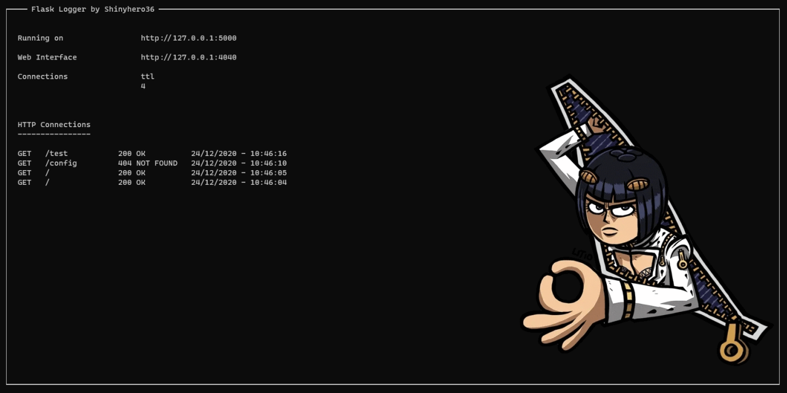

# Flask-Logger



## Installing
Install and update using [pip](https://pip.pypa.io/en/stable/quickstart/)

```bash
pip install -U flask-logger
```

## Example
```python
from flask import Flask
from flask_logger import FlaskLogger

app = Flask(__name__)
FlaskLogger(app)


@app.route("/")
def home():
    return """Hello World"""


if __name__ == "__main__":
    app.run(debug=True)
```
## Notes
This project is still in its early stages of development. Therefore, many bugs are remaining

## Contributing
Pull requests are welcome. For major changes, please open an issue first to discuss what you would like to change.


## Links
* Documentation: [yet to come](#)
* Releases: [yet to come](#)
* Code: [https://github.com/Shinyhero36/Flask-Logger](https://github.com/Shinyhero36/Flask-Logger)
* Issue Tracker: [https://github.com/Shinyhero36/Flask-Logger/issues](https://github.com/Shinyhero36/Flask-Logger/issues)

## License
[GNU General Public License v3.0](https://choosealicense.com/licenses/gpl-3.0/)